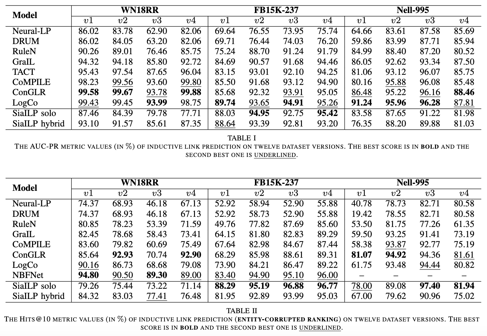
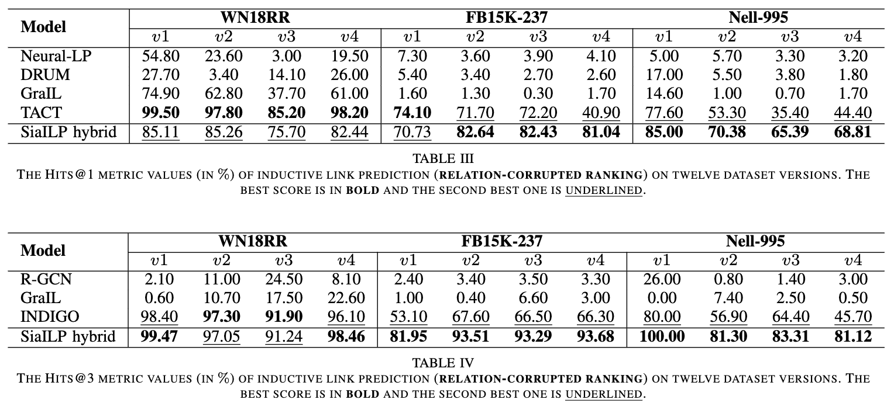

# Inductive Link Prediction in Knowledge Graphs using Path-based Neural Networks

### Introduction
This is the code of the [SiaILP](https://arxiv.org/abs/2312.10293) model for inductive link prediction. **Our paper was recently accepted to WCCI IJCNN 2024**. 

Link prediction is a crucial research area in knowledge graphs, with many downstream applications. In many real-world scenarios, inductive link prediction is required, where predictions have to be made among unseen entities (there are the same relation types being involved in the inference among the unseen entities). To achieve this, we focus-on a purely path-based approach. That is, given two source and target entities, the connection-paths between them and the out-reaching paths from each of them will be discovered. Then, relation embeddings will be assigned to each relation in a path, which generates an embedding sequence for the path. Finally, we train siamese neural networks (SNN) using input path embedding sequences to predict the ground-truth relation embedding between the source and target entities. The training is conducted using contrastive learning: The output embedding from the SNN will make an inner product with the given relation embedding. If the given relation embedding comes from the ground-truth relation, the inner product should be high (close to 1); If the given relation embedding comes from a corrupted relation, the inner product should be low.

The entire structure and network architecture is shown in the following graph: 

To be specific, there are two types of models proposed in our paper: The **connection-based model** and the **subgraph-based model**. Given two entities s and t, the connection-based model will discover paths connecting these two entities. Then, the embedding sequence of each connecting path will be used as input to the deep network. On the other hand, the subgraph-based model will discover out-reaching paths from entity s and t, and use the embedding sequence of each out-reaching path as input to the network.

Since we use **sia**mese neural network for **i**nductive **l**ink **p**rediciton, we call our model SiaILP. We train and evaluate the SiaILP model on the inductive versions of WN18RR, FB15K-237 and Nell-995 (There are four inductive versions for each of these datasets. More details can be found in the work [Inductive Relation Prediction by Subgraph Reasoning](https://arxiv.org/abs/1911.06962)). After training, the model is evaluated under AUC-PR; Hits@10 for entity corrupted ranking; and Hits@1,3 for relation corrupted ranking. Results show that SiaILP achieves several new state-of-the-art performances on these benchmark datasets:





We note that **SiaILP solo** refers to using only the subgraph-based model. **SiaILP hybrid** refers to combining both connection-based and subgraph-based models, with the output score from each model being averaged on a target triple. Also:

**Entity corrupted ranking**: Suppose we have a ground-truth triple (s, r, t), which indicates the existence of relation r from entity s to entity t. Then, we replace entity t with corrupted (randomly selected) entities t_1, t_2, t_3, ... We then apply the trained model to evaluate the correctness (scores) of (s, r, t_1), (s, r, t_2), etc. After that, we rank these triples in descending according to the scores provided by the model. Finally, if the ground-truth triple (s, r, t) is ranked among top N triples, we regard the model to make one correct performance. We obtain the percentage of correct performance made by the model on all ground-truth triples in the test set, which is used as the evaluation on the model.

**Entity corrupted ranking**: Similarly, we replace the relation r in a ground-truth triple (s, r, t) by r_1, r_2, etc. Then, we descend (s, r_1, t), (s, r_2, t), ... according to the output of the model, and observe the rank of the ground-truth triple as the performance of the model.

#### Model Advantage:

The major advantage of SiaILP model is that it is purely path-based: The model relies on no entity embeddings. All learned information is topological structure of the knowledge graph. As a result, SiaILP can be directly used for "strict" inductive link prediction without any fine-tuning. Also, since no entity embedding is required, the size of our SiaILP model can be small enough. This becomes a huge advantage when link prediction is required on industrial knowledge graphs involving billions of entities and changed dynamically. 

### Install/Usage

To install SiaILP, one can implement the following steps:
1. Install anaconda on your local device. Recommended to download the correct package from https://www.anaconda.com/ according to your system, and then install.
2. Clone this repository to your device: `git clone https://github.com/canlinzhang/SiaILP.git`. One can also use ssh or other clone methods.
3. Create a conda virtual environment with python 3.9: `conda create -n myenv python=3.9`.
4. Install packages by pip: `pip install numpy, scikit-learn, tqdm`.
5. Install packages by conda: `conda install tensorflow`.

### Train a SiaILP model

Training of our model is straightforward. One can simply run in terminal a command like this `python train.py --data_name 'WN18RR_v1' --model_name 'SiaILP_01' --num_epoch 10`. This will train a SiaILP model on the inductive version 1 of dataset WN18RR, with model name to be SiaILP_01 and training epoch to be 10. After training, checkpoints will be automatically saved under folder model_bin.

### Test a SiaILP model
After training, one can use `python test.py --data_name 'WN18RR_v1' --model_name 'SiaILP_01'` to evaluate the model on the test dataset. Make sure the data_name and model_name are consistent as in the traning in order to load existing models and evaluate on the correct test dataset.

**We note that seeking for faster evaluating speed, the default setting is to apply SiaIPL solo in the testing process for entity corrupted ranking. Our code will be updated shortly to include option on SiaILP solo and SiaILP hybrid.**

### Citation
If you are interested in our work, please cite our paper in your academic writings:
```
@inproceedings{zhang2024_SiaILP,
      title={Inductive Link Prediction in Knowledge Graphs using Path-based Neural Networks}, 
      author={Canlin Zhang and Xiuwen Liu},
      booktitle={International Joint Conference on Neural Networks (IJCNN)},
      year={2024},
      url={https://arxiv.org/abs/2312.10293}, 
}
```
